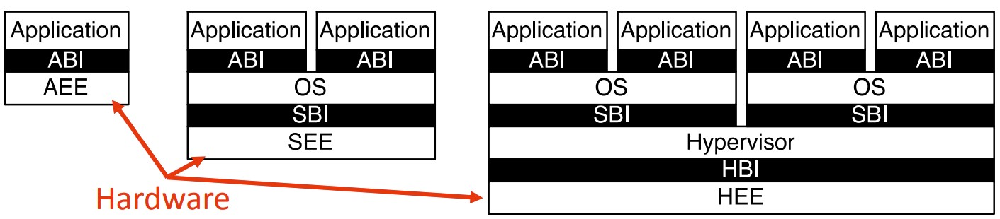

# RISC-V Privileged Architecture

## Why a Privlileged Architecture?

* 需要管理共享资源：内存、IO设备、CPU核心

* 需要保护共享资源：

    - 内存：虚拟内存映射

    - IO设备：虚拟内存映射

    - 访问权限：集成在映射中或者作为单独的功能模块

* 需要隐藏实现细节

    - 为软件仿真捕获未实现的操作

    - 处理外部异步事件

        + IO事件、计时器时间、其他线程的软件中断等

    - 用于支持 Hypervisor 的两级地址转换

* 在软件结构栈的各层级之间提供更加清晰的界限拆分

    

    |Layer      |Communicates with          |via                |
    |-----------|---------------------------|-------------------|
    |Application|Application Execution Environment (AEE)|Application Binary Interface (ABI)|
    |Operating System|Supervisor Execution Environment (SEE)|System Binary Interface (ABI)|
    |Hypervisor|Hypervisor Execution Environment (HEE)|Hypervisor Binary Interface (HBI)|

* 用于通信的ECALL指令

* 所有ISA级别设计以支持虚拟化

## Profiles

|Profile    |Modes  |Trust  |Mem Protect    |Other  |
|-----------|-------|-------|---------------|-------|
|Embedded without Protection|M|all Trusted|None|Low cost:16B each od arch. State/timers/counters|
|Embedded with Protection|M+ U|Apps untrusted|Phys Mem Protect|Optional N-extension for user int. handling|
|Unix-like OS capable|M+ S+ U|OS Trusted|Vmem + RWX|Vaddr size options:32,39,48b|
|Cloud OS|M+ [V] (S+ U)|Hypervisor Trusted|2-level Vmem + RWX|Unix+ (Supports > 1 OS) +new/background CSRs|

See [riscv-platform-specs](https://github.com/riscv/riscv-platform-specs)

## Privileges and Modes

* 特权模式（分层）

    - User          (U-mode), normal and virtualized    (lowest privileges)
    - Supervisor    (S-mode), normal and virtualized
    - Machine       (M-mode)                            (highest privileges)

    > 这里不包括hypervisor支持的virtualized模式
    >
    > 存在特权级别更高的（Debug）模式：仅在调试端口已连接并启用时进入，具有单独的状态保存CSR，但在其他方面很像M-mode

* 支持的特权模式组合：

    - M             简单的嵌入式系统
    - M, U          带保护的嵌入式系统
    - M, S, U       Unix-like的操作系统
    - M, [V]S, [V]U 多操作系统

* 每个特权模式添加一些操作，以及控制操作的控制/状态寄存器 (CSR)

    - CSRs只能由以特定权限模式或更高权限运行的代码访问
    - 每种模式通常有多个CSR副本或视图

## Privuleges Features

### Mode Specific Instructions

M-mode和S-Mode都比U-mode增加了其他指令, 特权指令只能从对应的或者更高级的模式中执行

* 所有模式

    - ECALL:    生成 <curr_mode>environment_call 异常
    - EBREAK:   生成断点异常
    - FENCE[.I]:同步更新内存
    - <x>RET:   从特定模式的trap中返回
        + SRET  仅在S-mode实现时提供
        + URET  仅在支持U-mode trap时提供 (N-extension)

* S-mode (+M-mode): adds

    - SFFENCE.VMA: 同步更新到隐士访问的内存

* M-mode: adds

    - WFI: 停止当前的 hart，直到中断需要服务
        + 只是一个提示（可能是 noop，可以将中断定向到这个 hart）

> In simple language, a hart is a RISC-V execution context that contains a full set of RISC-V architectural registers and that executes its program independently from other harts in a RISC-V system.
>
> hart 硬件线程？

### Mode Specific CSRs

* 控制或状态寄存器（CSRs）拥有他们自己的地址空间
    - 仅直接地址模式

* 每个hart拥有他们自己的一组4k CSR（1K/mode）

* CSRs由专用指令访问
    - 能实现原子swap或者bit set/clear

* CRSs是模式敏感的
    - 只能被对应的或者更高的特权模式访问；低等级的特权模式访问会trap

* 许多 CSR 可选，或者具有可选字段/模式依赖
    - 访问**不存在的**CSR会导致trap
    - 向**只读**CSR写入会导致trap
        + 但向读写CSR中的只读字段写入会被忽略
    - 访问**可选**CSR会读到0，并且会忽略写入
        + **可选**和**不存在**取决于架构

### CSR address space

## Memory Addressing

### Translation

### Protection

## Trap Handling

### Exceptions

### Interrupts

## Counters

### Time

### Performance

